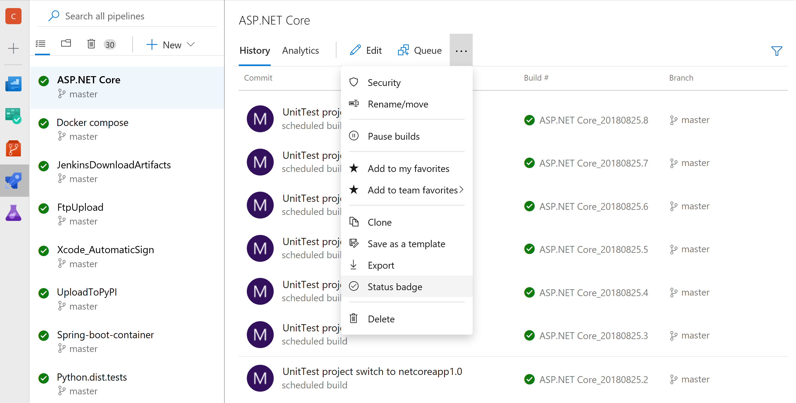

# :rocket: Create your first pipeline

In a few simple steps, set up continuous integration for a GitHub repository using Azure Pipelines.

:clock3: Duration: 5-10 minutes

## :pencil2: Prerequisites

* You'll need a **GitHub account**, where you can create a repository.
* You'll need a **Microsoft account**, otherwise known as a Live ID. If you already have one, such as a personal email address you use to sign into Windows at school or home, you can use it. Otherwise, [create a new one](https://signup.live.com/signup/).

## :hammer: Fork the AtUniverse repository

1. If you aren't already signed into GitHub, click **Sign in** at the top-right of this page. Enter your credentials to sign in.
1. Fork this repository by clicking **Fork** at the top-right of this page.
1. Choose to fork the repository in your personal GitHub account. GitHub will fork the repository and navigate to it in your account.

## :arrow_down: Install the Azure Pipelines GitHub App

1. Browse to https://github.com/apps/azure-pipelines and click **Install** (or Configure).
1. Click the name of your GitHub account into which the repository was forked. Then click **Install**.
1. After you're redirected to Azure DevOps, sign in with your Microsoft account (see [Prerequisites](#Prerequisites)).
1. If this is your first time using Azure DevOps, an organization will automatically be created for you. Otherwise:
    1. If you see a drop-down labeled "Select your Azure DevOps organization," then click **Create a new organization** below it.
    1. Click **Continue**. An Azure DevOps organization will be created for you that is linked to your GitHub account's repositories.

## :rocket: Create a new pipeline

1. After you're redirected to the **New pipeline** page of your Azure DevOps organization, select your **AtUniverse** repository fork to create a pipeline for it.
1. Select the **Docker image** template to build the repo's Dockerfile. Or, for an npm-only build, select **Node.js**.
1. YAML text that defines your pipeline will be displayed.
1. Click **Save and run**. In the pane that appears, select **Create a new branch for this commit and start a pull request**. Then, click **Save and run** at the bottom of the pane.
1. The YAML file is pushed to a new branch of your GitHub repository, a pull request is created for it, and you'll see the pipeline run for the first time.

### Check your build results on GitHub

1. Navigate to your repository fork in your GitHub account (ex: `https://github.com/janedoe/AtUniverse`).
1. Click the **Pull requests** tab and select the pull request that was created for you, named **Set up CI with Azure Pipelines**.
1. At the bottom of the page, click **Show all checks** to see the build status of your pipeline.
1. Near the top of the page, click the **Checks** tab. Select your build under the **Azure Pipelines** section to see more status information.

### Merge the pull request
1. Click on the **Conversation** tab near the top-left of the page. Click **Merge** to merge the pull request and enable continuous integration for your repository.

#### :tada: You did it! Congratulations!

Now, your pipeline will automatically run to validate each pull request and when new code is merged into the master branch of your repository.

## :grey_question: Optional next steps

#### :warning: When you're done, close all browser tabs to completely sign out

You've set up your first pipeline using Azure Pipelines. Consider trying these follow-on steps.

### Add the status badge to your repository
  
1. In Azure Pipelines, go to the **Builds** page to view the list of pipelines.
1. Select the pipeline that was created for you.
1. Click **". . ."** on the toolbar to view the context menu for the pipeline. Then, select **Status badge** (see the image below).
1. Copy the **Sample Markdown** text to the clipboard.
1. Paste the Markdown at the top of your repository's `README.md` file.

  

### Create another pipeline

Create additional pipelines by clicking **+ New build pipeline** from within Azure Pipelines.

### Deploy

Ask an Azure Pipelines representative how you can deploy your application to any platform or cloud.
